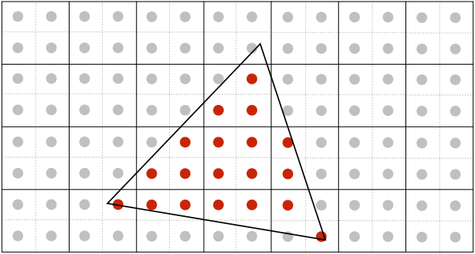
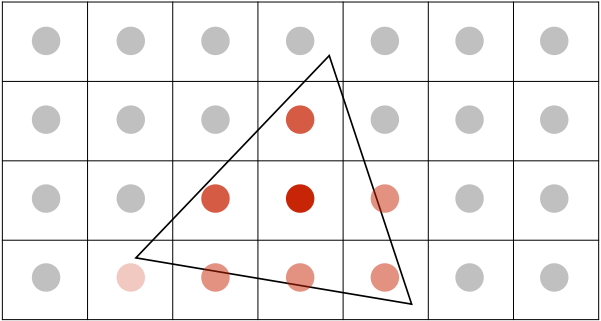

# 课程 5-7 阶段性总结

这部分内容主要介绍了：

- 光栅化（Rasterization）
- 抗锯齿/反走样（Anti-Aliasing）
- 深度测试（Z-Buffer）

## 光栅化

Raster（德语） = Screen，简单的来说光栅化就是将物体绘制到屏幕上。

屏幕主要由像素点构成，每个像素点可视为只包含一种颜色的小方块。

在屏幕上绘制内容需要得到各个像素点的颜色信息，光栅化事实上就是在做这个内容。

物体表面通常会被打散成一个个小三角形，通过数学关系可以判断像素点是否在一个三角形面内，这样就可以根据三角形的颜色信息对这个像素点进行着色了。

### 抗锯齿/反走样

出现锯齿的原因用比较官方点的话来说就是屏幕采样频率跟不上图像信息变化频率。

用夸张点的说法，有一张颜色丰富的图片需要显示在屏幕中，可惜屏幕只有一个像素点，只能用一个颜色来表示这幅图片。

所以提升屏幕分辨率，也就是使用2K、4K屏幕就可以解决抗锯齿的问题了，因此 **在高分辨率屏幕上往往不需要开抗锯齿**。

#### MSAA

当然，在屏幕分辨率不高的情况下仍然需要用到抗锯齿来还原一个更好的画面效果，MSAA就是一种方法。

通过增加采样点来判断像素点和三角形的关系。简单的理解就是把一个像素均分成更多像素。

以2x2为例，每个像素点中有4个小像素点，若4个小像素点都在三角形内，那么颜色的透明度就为100%，如果是2个则为50%。

通过这种方法修改像素点的颜色透明度，使边缘达到一种模糊的效果从而完成抗锯齿。






当然只需要在边界上使用即可，同时各个像素点之间还有复用检测点来缓解运算压力。

此外，还有FXAA、TAA等抗锯齿方法

### Z-Buffer

用来解决物体间遮盖的问题。

简单的来说，在维护屏幕上一张颜色信息表 `Frame-Buffer` 时，我们再维护一张颜色深度信息表 `Depth-Buffer` 用来表示这个颜色与摄像机的远近。

每当绘制像素点颜色时，只要比较并记录颜色深度信息，那么就可以让最靠近相机的颜色绘制在最前面。

假设 `z_interpolated` 越小表示离相机越近。

```c++
if (z_interpolated < depth_buf[index]) {
    depth_buf[index] = z_interpolated;
    frame_buf[index] = t.getColor();
}
```