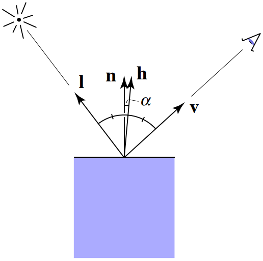
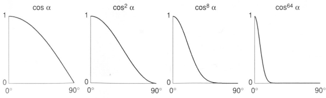

# 课程 7-10 阶段性总结

这部分内容主要介绍了：

- Blinn-Phong（光照模型）
- 着色频率
- 重心坐标
- 纹理放大

## Blinn-Phong（光照模型）

### Lambertian reflectance（漫反射模型）

${\displaystyle{\begin{aligned}
L_d=k_d\frac{I}{r^2}\max(0,n \cdot l)
\end{aligned}}}$

其中 $k_d$ 表示漫反射系数（也可以用漫反射颜色代替），$I$ 表示光照强度，$r$ 表示与光源的距离，$n$ 和 $l$ 分别为法向量与入射光方向

简单的来讲，这个模型认为漫反射的光照强度和光线与法向量的夹角有关。[^1]

### Specular（镜面反射）

${\displaystyle{\begin{aligned}
L_s=k_s\frac{I}{r^2}\max(0,n \cdot h)^p
\end{aligned}}}$

与漫反射模型相似，$k_s$ 表示镜面反射系数，$h$ **半程向量** 表示视线方向与光线方向的角平分方向。

事实上半程向量与法向量的夹角就是反射光线与视线的夹角，只不过半程向量更容易计算

值得注意的还有指数 $p$ ，这个值主要用于让函数值快速收缩，使高光区域不会太大

### Ambient（环境光）

${\displaystyle{\begin{aligned}
L_a=k_aI_a
\end{aligned}}}$

环境光主要用来表示其他光源产生的光照，这只是一个近似值，并不代表实际亮度。

---

最终全部相加可以得到 Blinn-Phong 光照模型的公式

${\displaystyle{\begin{aligned}
L=L_a+L_d+L_s=k_aI_a+k_d\frac{I}{r^2}\max(0,n \cdot l)+k_s\frac{I}{r^2}\max(0,n \cdot h)^p
\end{aligned}}}$

[^1]: [Lambert's cosine law](https://en.wikipedia.org/wiki/Lambert%27s_cosine_law)